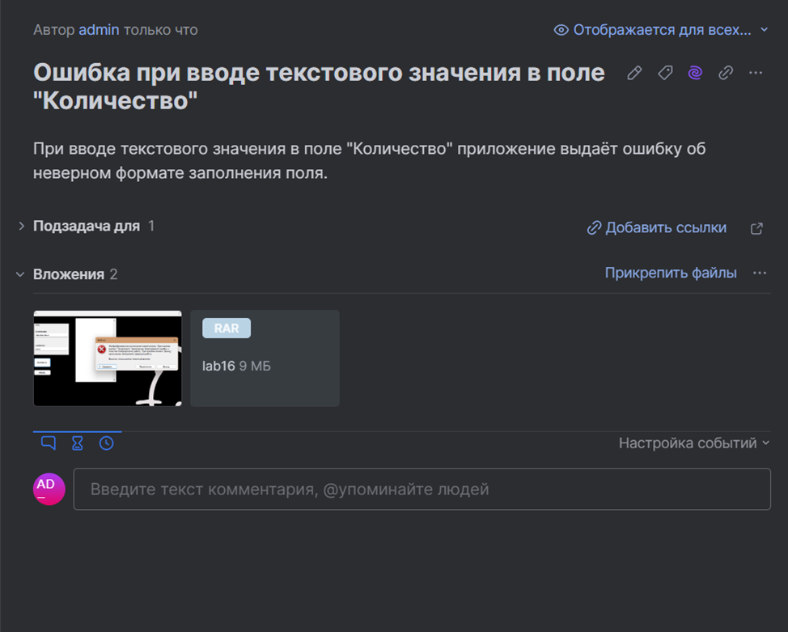

# Отчёт о дефекте №1
Пример использования JIRA для оформления отчёта о дефектах.

## Приложение к отчёту о дефекте:

- <a href="https://github.com/mortex-cpu/Reports-on-defects/blob/main/Project%20on%20C%2B%2B/assets/Stack/Stack/lab16/MyForm.h">Код программы</a>

<h3>Видео воспроизвдения ошибки</h3>
<video width="640" height="360" controls>
<source src="assets/Report on defect.mp4" type="video/mp4">
</video>